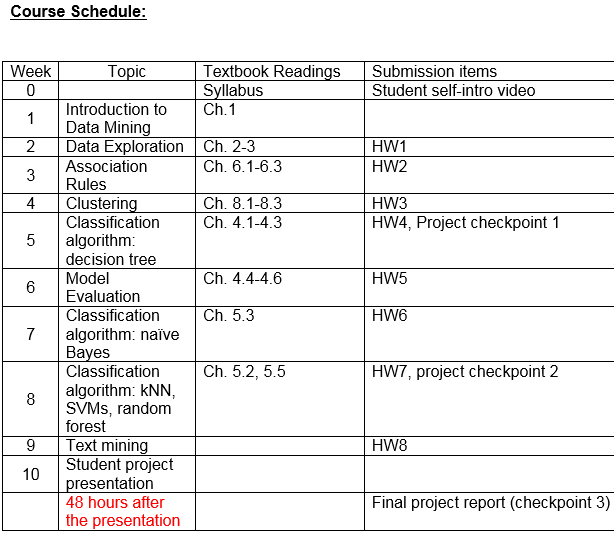

## Ryan Timbrook (Graduate Student - Course Work Repository)

## [Syracuse University, Masters of Applied Data Science](https://ischool.syr.edu/academics/graduate/masters-degrees/ms-in-applied-data-science/)

### IST 707 Data Analytics - Summar 2019
### SYLLABUS

                                   **SYRACUSE UNIVERSITY School of Information Studies**
                                           **IST - 707 Data Analytics**   

**Course Lead:** Professor Bei Yu (byu@syr.edu) 

**Prerequisite:** IST 687.  Exceptions maybe given to students who have acquired skills equivalent to what is taught in IST687 Audience:  Undergraduate and Graduate Students Description:  Introduction to data mining techniques, familiarity with particular realworld applications, challenges involved in these applications, and future directions of the field. Hands-on experience with open-source software packages. 

**Additional Course Description:**
* This course will introduce popular data mining methods for extracting knowledge from data. The principles and theories of data mining methods will be discussed and will be related to the issues in applying data mining to problems.  Students will also acquire hands-on experience using state-of-the-art software to develop data mining solutions to scientific and business problems. The focus of this course is in understanding of data and how to formulate data mining tasks in order to solve problems using the data.  

The topics of the course will include the key tasks of **data mining**, including **data preparation**, concept description, **association rule mining**, **classification**, **clustering**, **evaluation and analysis**. Through the exploration of the concepts and techniques of data mining and practical exercises, students will develop skills that can be **applied to business**, **science or other organizational problems**. 

The format of the class meetings will be a combined lecture and lab format, with lectures and class discussions to cover material and lab time to investigate small examples for the topic of the week.  There will be weekly readings based on the textbook and on other materials, which will be posted on-line.

**Learning Objectives:** After taking this course, the students will be able to: 
* Document, analyze, and translate data mining needs into technical designs and solutions. 
* Apply data mining concepts, algorithms, and evaluation methods to real-world problems. 
* Employ data storytelling and dive into the data, find useful patterns, and articulate what patterns have been found, how they are found, and why they are valuable and trustworthy.

[SYRACUSE UNIVERSITY School of Information Studies](https://ischool.syr.edu/)
